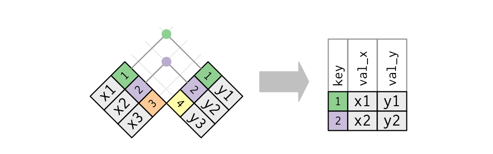
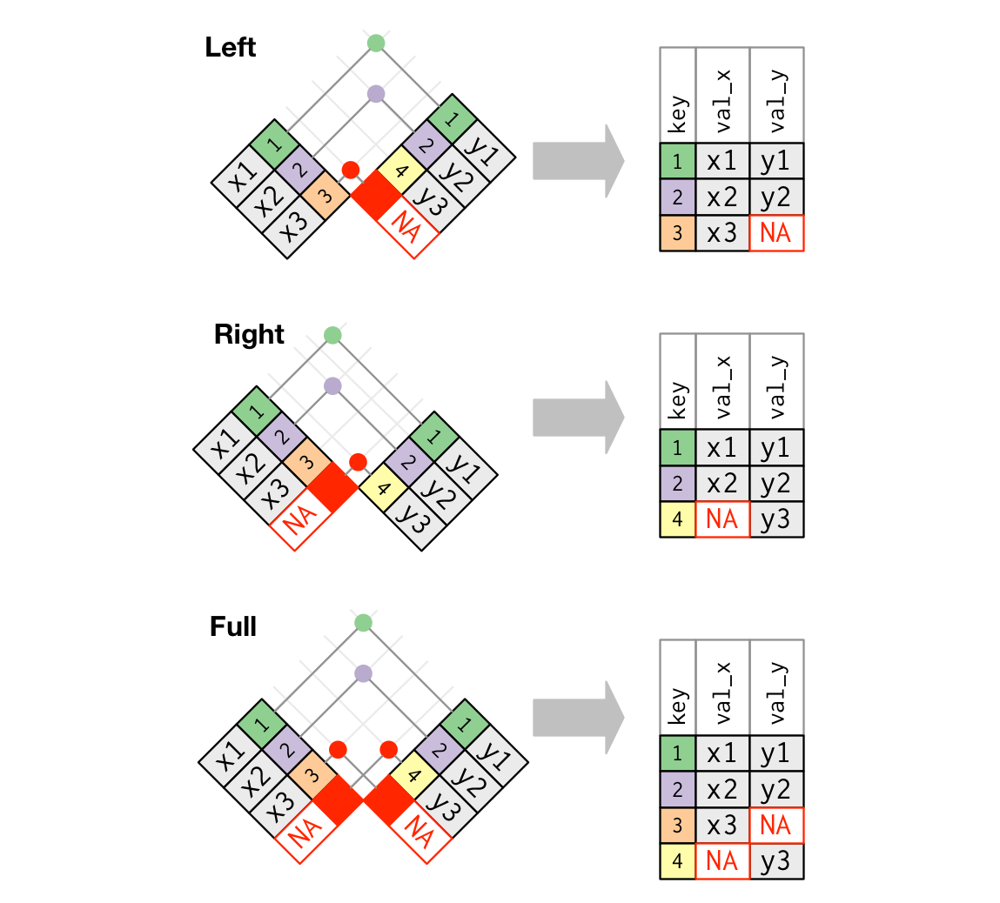

```{r setup, echo = FALSE}
knitr::opts_knit$set(root.dir = "C:/Users/bleb/OneDrive - University of Iowa/Courses/Uiowa/Comp")
```

Another common data manipulation task is to join multiple data sources into a single data file for an analysis. This task is most easily accomplished using a set of `join` functions found in the `dplyr` package. In this set of notes we are going to focus on mutating joins and filtering joins. There is another class of joins called set operations. I use these much less frequently, but for those interested, see the text in the R for Data Science book <http://r4ds.had.co.nz/relational-data.html>.

For this set of notes, we are going to make use of two packages:

```{r packages, message = FALSE}
library(tidyverse)
# install.packages('Lahman')
library(Lahman)
```

The `Lahman` package contains data from the Major League Baseball (MLB), a professional baseball association in the United States. For this section, we are going to focus on the following three data tables, `Teams`, `Salaries`, and `Managers`. I print the first ten rows of the data for each table below.

```{r data}
Teams
Salaries
Managers
```

## Inner Join
The most basic join is the inner join. This join takes two tables and returns values if key variables match in both tables. If rows do not match on the key variables, these observations are removed. Suppose for example, we wanted to select the rows that matched between the `Teams` and `Salaries` data. This would be useful for example if we wished to calculate the average salary of the players for each team for every year. 

This join could be done with the `inner_join` function.

```{r inner_join}
team_salary <- inner_join(Teams, Salaries)
team_salary
```

You'll notice that there is only data from 1985 onward, the data in the `Teams` data from before 1985 have automatically been removed due to no matching data in the `Salaries` data. You may have also noticed, that I did not specify the variables to join by above, for interactive work this can be okay, but to be more reproducible, specifying the variables to join on would be better. The function call above can be modified to include this information.

```{r inner_join_var}
team_salary <- inner_join(Teams, Salaries, by = c('yearID', 'teamID', 'lgID'))
team_salary
```

We could then use other `dplyr` verbs to calculate the average salary for every team by year and plot these.

```{r avg_salary}
team_salary %>%
  group_by(yearID, teamID) %>%
  summarise(avg_salary = mean(salary, na.rm = TRUE)) %>%
  ggplot(aes(x = yearID, y = avg_salary)) + 
  geom_line(size = 1) + 
  facet_wrap(~teamID)
```

Below is a diagram of the inner join found in the R for Data Science text:


## Left Join
This is by far the most common join I perform. Left join is more formally part of a group of operations called outer joins. Outer joins are useful when you want to use one data table as a base data set in which variables will be added to this data if the keys match. It is likely best shown with an example. 

Suppose we wish to add the salary information to the `Teams` data. However, instead of using a `inner_join`, let's use `left_join` to see the difference.

```{r left_join}
left_join(Teams, Salaries)
```

The first thing to notice is that now there are years in the yearID variable from before 1985, this was not the case in the above data joined using `inner_join`. If you scroll over to explore variables to the right, there are missing values for the salary variable. What `left_join` does when it doesn't find a match in the table is to produce NA values, so all records within the joined data will be NA before 1985. 

This is the major difference between outer joins and inner joins. Outer joins will preserve data in the keyed data that do not match and NA values are returned for non-matching values. For inner joins, any keys that do not match are removed.

## Right Join
A right join is similar to a left join, except the keyed table is the second one specified (the rightmost data). For example, if we wished for the salary information to be the keyed table, we could do that same specification as above, but use `right_join` instead of `left_join`.

```{r right_join}
right_join(Teams, Salaries)
```

This data is very similar (although not identical) to the one from the inner join above. Can you spot what is different?

## Full Join
Full join is the last type of outer join and this will return all values from both tables and NAs will be given for those keys that do not match. For example,

```{r full_join}
full_join(Teams, Salaries)
```

This data is very similar to the left join above, but not identical, can you tell the difference again?

Below is a diagram of the differences between the three outer joins from the R for Data Science text:


## Filtering Joins
I tend to not use filtering joins, however, these are useful to connect summary data back to the original rows in the data. For example, using the `team_salary` data created above, let's select only the top 10 teams in terms of average salary from the year 2015.

```{r filter}
top_salary_15 <- team_salary %>%
  group_by(yearID, teamID) %>%
  summarise(avg_salary = mean(salary, na.rm = TRUE)) %>%
  filter(yearID == 2015) %>%
  arrange(desc(avg_salary)) %>%
  head(10)
top_salary_15
```

Although not impossible, it would be a bit more difficult to connect these teams and years back to the original data in the `team_salary` data. This can be done simply with a filtering join, namely a semi join.

```{r semi_join}
team_salary %>%
  semi_join(top_salary_15)
```

This operation selected only the rows that had the matching keys from the first table (note that the columns were not touched). 

The opposite operation is to use an anti join, in this type of join, the rows that do not match will be returned.

```{r anti_join}
team_salary %>%
  anti_join(top_salary_15)
```

The sum of the number of rows in these two tables should equal the number of rows from the entire `team_salary` data table

```{r match_rows}
anti_rows <- team_salary %>%
  anti_join(top_salary_15) %>%
  nrow()
semi_rows <- team_salary %>%
  semi_join(top_salary_15) %>%
  nrow()
anti_rows + semi_rows == nrow(team_salary)
```

#### Exercises
1. Using the `Teams` and `Managers` data, join the two tables and only keep the matching observations in both tables. Note, you may need to specify the column names directly you wish to join by. What happens to the columns that have the same names but are not keys?
2. Using the same data tables from #1, add all the `Managers` variables to the `Teams` data while retaining all the rows for the `Teams` data. 

