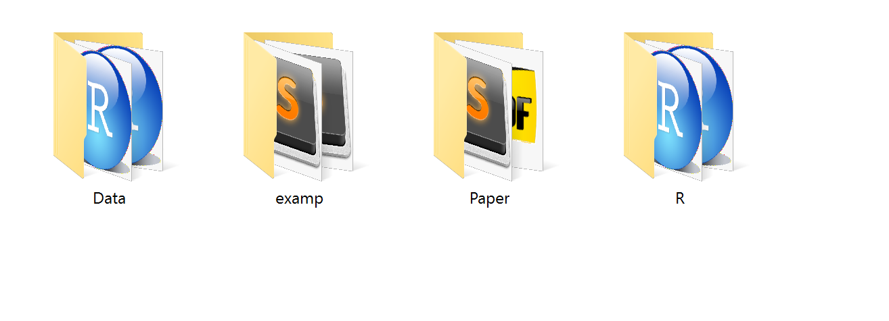

I want to talk briefly about RStudio projects. These are a great way to structure each individual project. Chapter 8 in the R for Data Science text will provide a more thorough discussion of RStudio projects: <http://r4ds.had.co.nz/workflow-projects.html>

## Working Directory
As we move into reading in data files, the idea of a working directory will become even more important. RStudio projects makes this discussion much easier as the root of the project directory is treated as the working directory. The nice aspect of this is that all paths to data files are in reference to this root project directory (more on this coming soon).

## Project Structure
The last aspect I want to share is a common project directory structure. Everyone can have slightly different versions, but I want to share what I have come to commonly use. The following structure is how I tend to structure most or my projects.

Another way to visualize this structure is as follows:

- Project Root:
    + Data
    + examp
    + paper
    + R
